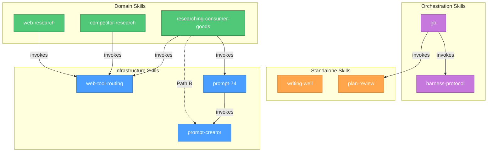

# skill-arsenal

Curated collection of Claude Code skills — research, writing, and more.

## Skills

### Infrastructure (shared by domain skills)

| Skill | Description |
|-------|-------------|
| **web-tool-routing** | Shared web tool routing, detection, and fallback chains. Credit-aware tool selection for any skill or agent that accesses websites. |
| **prompt-creator** | Prompt engineering best practices from Anthropic and OpenAI docs. Crafts effective prompts for any LLM — system prompts, agent instructions, research handoff prompts. |
| **prompt-74** | High-stakes prompt methodology (PROMPT-74 framework). Generates structured, evidence-driven prompts for complex decisions, deep research, and strategy analysis. |

### Domain (invoke infrastructure skills + add domain logic)

| Skill | Description |
|-------|-------------|
| **web-research** | Web research methodology with wave-based execution, creative query strategies, and structured output. General-purpose research for any topic. |
| **competitor-research** | Gathers and analyzes community feedback about competitors from Reddit, forums, and review sites. Structured analysis with sentiment, quotes, and cross-thread synthesis. |
| **researching-consumer-goods** | Multi-stage consumer product research. Gathers requirements, searches global markets, compares prices, and generates structured reports. |

### Standalone (no dependencies)

| Skill | Description |
|-------|-------------|
| **writing-well** | Applies Zinsser's nonfiction writing principles to any text — emails, docs, marketing copy, blog posts. Simplicity, clarity, no clutter. |
| **plan-review** | Structured technical review of plans and code changes. Architecture, code quality, testing, performance, risk — interactive issue-by-issue walkthrough. |

### Orchestration (coordinate sub-agents end-to-end)

| Skill | Description |
|-------|-------------|
| **harness-protocol** | Orchestrator → Developer → Verifier → Auditor pattern for multi-sprint / multi-file work. Generator never self-evaluates. Hard >9/10 per-criterion threshold. Project-agnostic — discovers the project's verification commands at runtime. |
| **go** | End-to-end feature pipeline: plan → harness protocol → `plan-review` → Codex plan audit → execute with strict harness → `simplify` → final Codex audit (E2E gaps / edge cases / over-engineering). Runs inside an isolated git worktree. Codex is optional — skipped cleanly when the CLI isn't available. Project-agnostic. |

## How it works

Skills form three layers: **infrastructure** (how to access the web, how to write prompts), **domain** (what to research + invoke infrastructure at runtime), and **standalone** (direct output, no dependencies).



Here's what that looks like in practice — just say what you need, and the right skills activate automatically:

> **"Find me trail running shoes under $150"**
>
> `researching-consumer-goods` → `prompt-74` (interview) → `web-tool-routing` (search) + optionally `prompt-creator` (Path B)
>
> Interviews you first (budget? terrain? pronation?), then searches stores with detected MCP tools. If handing off to external AI, formats the prompt for the target model. Output: requirements brief, verified price tables, BEST-PICKS + FINAL-REPORT.

> **"What do people say about Linear vs Jira?"**
>
> `competitor-research` → `web-tool-routing`
>
> Detects available tools, applies domain override for Reddit (ScrapingBee — only tool that reliably reads Reddit). Output: sentiment analysis, top community quotes, consensus view.

> **"Deep dive into React Server Components"**
>
> `web-research` → `web-tool-routing`
>
> Wave-based research with search + read tool selection and automatic fallbacks. Output: executive summary, detailed findings with sources, recommendations.

> **"prompt74 plan a holiday in Spain"** (direct use)
>
> `prompt-74` → `prompt-creator`
>
> Interviews you first — budget? timeline? interests? (up to 10 questions, one at a time). Then builds a structured PROMPT-74 prompt and delivers it in conversation. No external tools invoked.

> **"prompt74 deep research for Portugal immigration"** (external AI handoff)
>
> `prompt-74` → `prompt-creator`
>
> Same interview phase, then generates a prompt formatted for external AI. You paste it into ChatGPT Deep Research, Gemini, etc. — prompt-74 never auto-triggers MCP research tools like Tavily.

> **"Rewrite this investor email"** → `writing-well`
> **"Review my implementation plan"** → `plan-review`
>
> Standalone skills — direct output, no other skills invoked.

> **"/go add a rate-limit middleware"** (full pipeline)
>
> `go` → `harness-protocol` → `plan-review` → Codex (optional) → `superpowers:executing-plans` → `simplify` → Codex final audit
>
> Creates a worktree, writes a plan, auto-accepts plan-review recommendations, commits the plan, runs a Codex plan audit (skipped cleanly if Codex isn't installed), executes sprint-by-sprint with fresh Developer/Verifier/Auditor sub-agents per sprint, simplifies, then runs a final Codex audit that must return findings in three labeled buckets (E2E gaps, edge cases, over-engineering). Project-agnostic — detects the project's verification gate from `.claude/rules/`, `package.json`, or `Makefile`.

## Installation

### Claude Code (via Plugin Marketplace)

```bash
# Register the marketplace
/plugin marketplace add yanchuk/skill-arsenal

# Install plugins (infrastructure first, then domain, then standalone)
/plugin install web-tool-routing@skill-arsenal
/plugin install prompt-creator@skill-arsenal
/plugin install prompt-74@skill-arsenal
/plugin install web-research@skill-arsenal
/plugin install competitor-research@skill-arsenal
/plugin install researching-consumer-goods@skill-arsenal
/plugin install writing-well@skill-arsenal
/plugin install plan-review@skill-arsenal
/plugin install harness-protocol@skill-arsenal
/plugin install go@skill-arsenal
```

> **Installation order:** Install infrastructure skills first — domain skills invoke them at runtime.

### Cursor

1. Open **Cursor Settings** → **Rules**
2. In **Project Rules**, click **Add Rule** → **Remote Rule (GitHub)**
3. Enter the repository URL:

```
https://github.com/yanchuk/skill-arsenal.git
```

### Codex

```
Fetch and follow instructions from https://raw.githubusercontent.com/yanchuk/skill-arsenal/refs/heads/main/docs/README.codex.md
```

### OpenCode

```
Fetch and follow instructions from https://raw.githubusercontent.com/yanchuk/skill-arsenal/refs/heads/main/docs/README.opencode.md
```

### Manual (any agent)

```bash
git clone https://github.com/yanchuk/skill-arsenal.git
cp -r skill-arsenal/skills/writing-well ~/.claude/skills/
# Or: ~/.cursor/skills/ | ~/.agents/skills/
```

## Repo structure

```
skill-arsenal/
├── .claude-plugin/
│   └── marketplace.json        # Claude Code plugin marketplace catalog
├── docs/                       # Platform-specific install guides + architecture
│   ├── README.codex.md
│   ├── README.opencode.md
│   └── skill-relations.md      # Mermaid diagram of skill dependencies
├── plugins/                    # Claude Code plugin wrappers
│   ├── web-tool-routing/       # Infrastructure
│   ├── prompt-creator/         # Infrastructure
│   ├── prompt-74/              # Infrastructure
│   ├── web-research/           # Domain
│   ├── competitor-research/    # Domain
│   ├── researching-consumer-goods/  # Domain
│   ├── writing-well/           # Standalone
│   ├── plan-review/            # Standalone
│   ├── harness-protocol/       # Orchestration
│   └── go/                     # Orchestration
├── skills/                     # Universal entry point (symlinks into plugins/)
│   ├── web-tool-routing → ../plugins/.../
│   ├── prompt-creator → ../plugins/.../
│   ├── prompt-74 → ../plugins/.../
│   ├── web-research → ../plugins/.../
│   ├── competitor-research → ../plugins/.../
│   ├── researching-consumer-goods → ../plugins/.../
│   ├── writing-well → ../plugins/.../
│   ├── plan-review → ../plugins/.../
│   ├── harness-protocol → ../plugins/.../
│   └── go → ../plugins/.../
├── CLAUDE.md                   # Repo conventions and architecture
└── README.md
```

- **`plugins/`** — Claude Code plugin marketplace format with manifests
- **`skills/`** — Universal layout (symlinks). Works with Cursor, Codex, and any compliant agent

## Credits

- **[prompt-74](plugins/prompt-74/)** — methodology inspired by [slash](https://github.com/slash)
- **[superpowers](https://github.com/obra/superpowers)** — foundational skill patterns by [obra](https://github.com/obra)

## Local development

```bash
# Claude Code — test a plugin locally
claude --plugin-dir ./plugins/researching-consumer-goods

# Validate marketplace structure
claude plugin validate .
```

## Contributing

1. Create your plugin directory under `plugins/<name>/`
2. Add `.claude-plugin/plugin.json` with name, description, version, author
3. Add your skill under `plugins/<name>/skills/<skill-name>/SKILL.md`
4. Add a symlink: `ln -s ../plugins/<name>/skills/<skill-name> skills/<skill-name>`
5. Add an entry to `.claude-plugin/marketplace.json`
6. Run `claude plugin validate .` to verify
