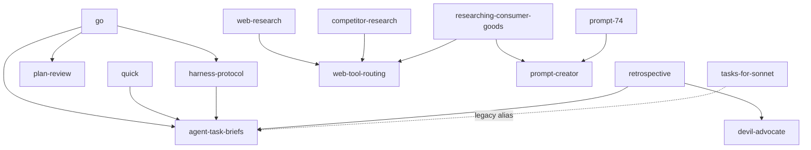

# skill-arsenal

Agent-agnostic skills for research, writing, review, and orchestration.

Skills describe reusable workflows. Claude Code, Codex, OpenCode, Cursor, and
other agents are runtime adapters.

**Fast install:** `npx skills add yanchuk/skill-arsenal`

## Skills

### Infrastructure

| Skill | Use |
|-------|-----|
| **web-tool-routing** | Pick the right search, fetch, browser, or MCP tool for web access. |
| **prompt-creator** | Write prompts and handoffs for Claude, ChatGPT, Gemini, Codex, or other LLMs. |
| **prompt-74** | Build high-stakes prompts for complex decisions, research, and strategy. |

### Research

| Skill | Use |
|-------|-----|
| **web-research** | Research online topics with source checks and structured findings. |
| **competitor-research** | Analyze competitors through Reddit, forums, reviews, and community feedback. |
| **researching-consumer-goods** | Compare products, prices, availability, and deals across stores. |

### Writing And Review

| Skill | Use |
|-------|-----|
| **writing-well** | Tighten human-facing writing: docs, emails, copy, reports, and posts. |
| **plan-review** | Review plans, diffs, and implementation approaches. |
| **devil-advocate** | Run an adversarial review of a plan, PR, design, or RFC. |

### Orchestration

| Skill | Use |
|-------|-----|
| **agent-task-briefs** | Write invariant-first briefs and model-lane decisions for workers, scouts, reviewers, and verifiers. |
| **tasks-for-sonnet** | Compatibility alias for older plans that still reference Sonnet-specific wording. |
| **harness-protocol** | Run Developer -> Verifier -> Auditor gates for Claude/Superpowers or Codex subagents. |
| **go** | Full feature pipeline: plan, review, execute, verify, simplify, and audit. |
| **quick** | Smaller 1-3 file pipeline without a worktree or full harness. |
| **retrospective** | Review recent work, turn misses into process updates, and spot workflows worth packaging. |

## How It Fits Together


```mermaid
graph TB
    GO["go"] --> HP["harness-protocol"]
    GO --> PR["plan-review"]
    GO --> ATB["agent-task-briefs"]
    Q["quick"] --> ATB
    HP --> ATB
    R["retrospective"] --> DA["devil-advocate"]
    R --> ATB

    WR["web-research"] --> WTR["web-tool-routing"]
    CR["competitor-research"] --> WTR
    RCG["researching-consumer-goods"] --> WTR
    RCG --> PC["prompt-creator"]
    P74["prompt-74"] --> PC

    TFS["tasks-for-sonnet"] -.->|"legacy alias"| ATB
```

## Installation

### skills.sh

```bash
npx skills add yanchuk/skill-arsenal
```

### Claude Code

```bash
/plugin marketplace add yanchuk/skill-arsenal
/plugin install web-tool-routing@skill-arsenal
/plugin install prompt-creator@skill-arsenal
/plugin install prompt-74@skill-arsenal
/plugin install web-research@skill-arsenal
/plugin install competitor-research@skill-arsenal
/plugin install researching-consumer-goods@skill-arsenal
/plugin install writing-well@skill-arsenal
/plugin install plan-review@skill-arsenal
/plugin install devil-advocate@skill-arsenal
/plugin install agent-task-briefs@skill-arsenal
/plugin install tasks-for-sonnet@skill-arsenal
/plugin install harness-protocol@skill-arsenal
/plugin install go@skill-arsenal
/plugin install quick@skill-arsenal
/plugin install retrospective@skill-arsenal
```

### Codex

```bash
codex plugin marketplace add yanchuk/skill-arsenal --sparse .agents/plugins
```

Restart Codex after installing or updating skills.

### Other agents

Clone the repo and let the agent wire the skills in:

```bash
git clone https://github.com/yanchuk/skill-arsenal.git
```

Then prompt your agent: *"Explore `skills/` in this repo and install each skill
into your skills directory."* Every skill is a self-contained
`skills/<name>/SKILL.md` — copy or symlink the ones you want into wherever your
runtime discovers skills.

## Repository Layout

```text
skill-arsenal/
├── .agents/plugins/                 # Codex marketplace metadata
├── .claude-plugin/                  # Claude Code marketplace metadata
├── plugins/<name>/
│   ├── .claude-plugin/plugin.json
│   ├── .codex-plugin/plugin.json
│   └── skills/<name>/SKILL.md
├── skills/                          # Universal symlink entry point
├── docs/                            # Platform guides and design notes
└── scripts/check-plugin-versions.sh
```

## Development

```bash
# Check marketplace and manifest drift
scripts/check-plugin-versions.sh

# Validate Claude plugin metadata
claude plugin validate .

# Inspect Codex marketplace command support
codex plugin marketplace --help

# Check universal skill discovery
find -L skills -maxdepth 2 -name SKILL.md | sort
```

When changing a skill, bump both plugin manifests and both marketplace entries.
`scripts/check-plugin-versions.sh` enforces that lockstep.

## Compatibility

`tasks-for-sonnet` remains as a legacy alias for one release. New plans and
skills should use `agent-task-briefs`. In Codex, old Sonnet wording maps to the
worker-agent lane; bounded tasks can use `worker`, `explorer`, or a custom
`.codex/agents/*.toml` agent such as a `gpt-5.3-codex-spark` worker.

## Credits

- [prompt-74](plugins/prompt-74/) is inspired by [slash](https://github.com/slash).
- [superpowers](https://github.com/obra/superpowers) by [obra](https://github.com/obra) shaped several workflow patterns.
