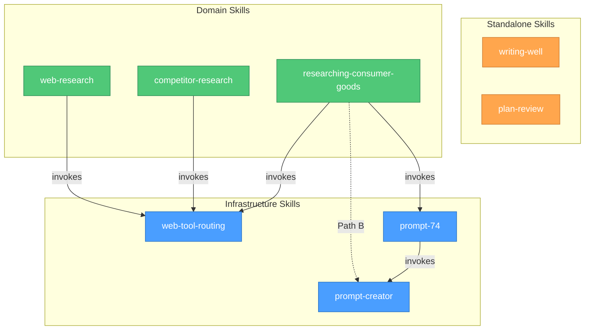

# Skill Relations

Architecture diagram showing the three-layer skill system and dependency relationships.

## Legend

- **Blue (Infrastructure):** Shared capabilities invoked by domain skills at runtime via the Skill tool
- **Green (Domain):** Research/analysis skills that invoke infrastructure + add domain-specific logic and overrides
- **Orange (Standalone):** Independent skills with no cross-skill dependencies
- **Solid arrows:** "invokes at runtime via Skill tool"
- **Dashed arrows:** conditional invocation (only on specific paths)
