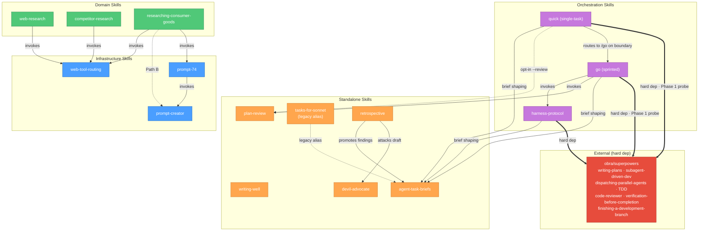

# Skill Relations

Architecture diagram showing the four-layer skill system and dependency relationships.

```mermaid
graph TB
    subgraph Orchestration["Orchestration Skills"]
        GO["go (sprinted)"]
        QK["quick (single-task)"]
        HP["harness-protocol"]
    end

    subgraph Standalone["Standalone Skills"]
        WW["writing-well"]
        PR["plan-review"]
        DA["devil-advocate"]
        ATB["agent-task-briefs"]
        TFS["tasks-for-sonnet<br/>(legacy alias)"]
        RT["retrospective"]
    end

    subgraph Domain["Domain Skills"]
        WR["web-research"]
        CR["competitor-research"]
        RCG["researching-consumer-goods"]
    end

    subgraph Infrastructure["Infrastructure Skills"]
        WTR["web-tool-routing"]
        PC["prompt-creator"]
        P74["prompt-74"]
    end

    subgraph External["External (hard dep)"]
        SP["obra/superpowers<br/>writing-plans · subagent-driven-dev<br/>dispatching-parallel-agents · TDD<br/>code-reviewer · verification-before-completion<br/>finishing-a-development-branch"]
    end

    %% Orchestration → other skills
    GO -->|"invokes"| HP
    GO -->|"invokes"| PR
    GO -->|"brief shaping"| ATB
    HP -->|"brief shaping"| ATB
    QK -->|"brief shaping"| ATB
    RT -->|"promotes findings"| ATB
    RT -->|"attacks draft"| DA
    TFS -.->|"legacy alias"| ATB
    QK -.->|"opt-in --review"| PR
    QK -->|"routes to /go on boundary"| GO

    %% Hard dependency on superpowers (fail-fast probe at Phase 1)
    GO ==>|"hard dep · Phase 1 probe"| SP
    HP ==>|"hard dep"| SP
    QK ==>|"hard dep · Phase 1 probe"| SP

    %% Domain → Infrastructure invocations
    WR -->|"invokes"| WTR
    CR -->|"invokes"| WTR
    RCG -->|"invokes"| WTR
    RCG -.->|"Path B"| PC
    RCG -->|"invokes"| P74

    %% Infrastructure → Infrastructure
    P74 -->|"invokes"| PC

    %% Styling
    style WTR fill:#4a9eff,stroke:#2670c2,color:#fff
    style PC fill:#4a9eff,stroke:#2670c2,color:#fff
    style P74 fill:#4a9eff,stroke:#2670c2,color:#fff
    style WR fill:#50c878,stroke:#2e8b57,color:#fff
    style CR fill:#50c878,stroke:#2e8b57,color:#fff
    style RCG fill:#50c878,stroke:#2e8b57,color:#fff
    style WW fill:#ffa64d,stroke:#cc7a30,color:#fff
    style PR fill:#ffa64d,stroke:#cc7a30,color:#fff
    style DA fill:#ffa64d,stroke:#cc7a30,color:#fff
    style ATB fill:#ffa64d,stroke:#cc7a30,color:#fff
    style TFS fill:#ffa64d,stroke:#cc7a30,color:#fff
    style RT fill:#ffa64d,stroke:#cc7a30,color:#fff
    style GO fill:#c678dd,stroke:#8e3da8,color:#fff
    style HP fill:#c678dd,stroke:#8e3da8,color:#fff
    style QK fill:#c678dd,stroke:#8e3da8,color:#fff
    style SP fill:#e74c3c,stroke:#a93226,color:#fff
```

## Legend

- **Purple (Orchestration):** End-to-end pipeline skills that coordinate other skills and sub-agents
- **Blue (Infrastructure):** Shared capabilities invoked by domain skills at runtime via the Skill tool
- **Green (Domain):** Research/analysis skills that invoke infrastructure + add domain-specific logic and overrides
- **Orange (Standalone):** Independent skills with no cross-skill dependencies
- **Red (External hard dep):** Third-party plugin required for the orchestration skills to run; `/go` Phase 1 fail-fast probe aborts cleanly when any required `superpowers:*` skill is missing
- **Solid arrows:** "invokes at runtime via Skill tool"
- **Bold arrows (`==>`):** "hard dependency — skill refuses to run if missing"
- **Dashed arrows:** conditional invocation (only on specific paths)
