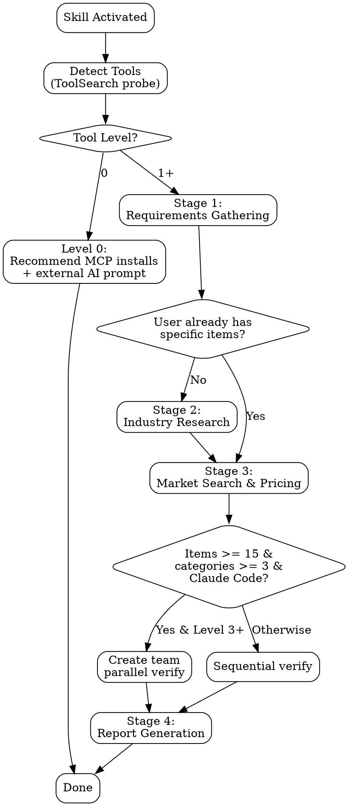

# Researching Consumer Goods

## Overview

Multi-stage consumer goods research skill. Gathers expert requirements, researches industry recommendations, searches local and global markets for prices and availability, and generates structured reports. Adapts to any product domain and geographic market.

## Main Workflow



---

## Stage 1: Expert Requirements Gathering

**Goal:** Understand what the user needs before any research begins.

Using AskUserQuestion (or conversational Q&A), gather the following. Ask only what's missing — if the user's initial request already provides some answers, skip those.

**Universal questions (always ask if not provided):**

1. **Product domain** — Auto-detect from request or ask. Examples: ski gear, TVs, running shoes, furniture, cameras.
2. **Geography** — ALWAYS ASK: "Where are you located? This determines which stores, marketplaces, languages, and currencies I search." Never assume geography. Build geo context dynamically from the user's answer: country, language, currency, local marketplaces (e.g., Allegro for Poland, Amazon.de for Germany, Rakuten for Japan), shipping zones.
3. **Budget range** — In the user's local currency.
4. **Priority** — Quality / value / price-quality balance.
5. **Existing items** — Does the user already have specific items or brands in mind? If yes, skip Stage 2 and go directly to Stage 3 (verification only).
6. **Timeline** — Buying now vs. waiting for sales? End-of-season clearance timing matters.

**Domain-specific questions** — Read `references/expert-questions.md` for the relevant product domain. Ask the 3-5 most important domain-specific questions (sizes, specs, certifications, etc.).

**Output:** Save structured requirements brief to `{output-dir}/requirements.md` with all gathered parameters.

---

## Stage 2: Industry Research

**Goal:** Find expert-recommended items matching requirements.

Ask the user which path they prefer:

### Path A — Agent researches directly

- Search trusted review sites using available web tools (Jina search, WebSearch, Tavily)
- Domain-specific review sources are listed in `references/expert-questions.md` per domain
- Search in user's language AND English for broader coverage
- Cross-reference 3+ review sources per item
- Consider geo availability of brands (not all brands are sold in every market)
- Compile candidate item list (8-60 items depending on scope and categories)

### Path B — Generate external AI prompt

- Generate structured prompt from `references/external-ai-prompts.md`
- Parameterize with: category, geo, budget, currency, priority, language, review sites, specific requirements
- User pastes into ChatGPT Deep Research / Gemini Deep Research / Claude Extended Thinking
- User returns with item list → proceed to Stage 3
- Always include closing instruction: "After receiving results, return here and I'll verify prices and availability"

**Output:** Save candidate list to `{output-dir}/research-items.md`.

---

## Stage 3: Market Search & Pricing

**Goal:** Find real prices, check availability, verify sizes/variants across markets.

### 3a. Tool Detection (CRITICAL — run first)

Probe available MCP tools using ToolSearch. Classify capability level:

| Level | Tools Available | Strategy |
|-------|----------------|----------|
| 4 (FULL) | Built-in + Jina + Firecrawl + ScrapingBee + browser | Full chain, anti-bot capable |
| 3 (STRONG) | Built-in + Jina + (Firecrawl OR ScrapingBee) | Strong chain, most sites |
| 2 (BASIC) | Built-in + (Jina OR Tavily) | Good coverage, no anti-bot bypass |
| 1 (BASELINE) | WebSearch + WebFetch only (built-in) | Always available. Search + basic fetch. |
| 0 (NONE) | No web tools at all | Recommend MCP installs + external AI prompt |

**ToolSearch probes to run:**
```
ToolSearch("+jina read")
ToolSearch("+firecrawl scrape")
ToolSearch("+scrapingbee")
ToolSearch("+tavily search")
ToolSearch("+playwright navigate")
```

**At Level 0-1**, output MCP installation commands and suggest Path B (external AI prompt):
```
claude mcp add jina -s user -- npx -y @anthropic/jina-mcp-server
claude mcp add firecrawl-mcp -s user -- npx -y firecrawl-mcp
claude mcp add scrapingbee -s user -- npx -y scrapingbee-mcp
```

### 3b. Tool Fallback Chain

Read `references/tool-fallback-chain.md` for the complete tiered fallback strategy. Key principles:

- **Built-in tools first, always.** WebSearch and WebFetch are the baseline — always available, truly unlimited, no MCP required. Free MCP tools (Jina, Tavily) enhance with geo-targeting and better extraction but have consumable free tiers (Jina: 10M tokens; Tavily: limited free requests). Paid tools are escalation only.
- **Paid tools for failures only.** Firecrawl (1 credit/page) and ScrapingBee (1-10 credits) are escalation tiers.
- **Browser tools are last resort.** Playwright and Chrome MCP are slow, context-heavy, and should only be used when all API tools fail.
- **Mark UNVERIFIED when all tiers fail.** Include the manual-check URL so the user can verify themselves.

### 3c. Team Decision (Claude Code only)

If ALL conditions met: items >= 15 AND categories >= 3 AND tool level >= 3:
- Offer to create a parallel agent team
- Read `references/team-orchestration.md` for team setup details
- Structure: Opus leader + N Sonnet workers (1 per category, max 6)
- Each worker gets: item list, geo context, tool fallback chain, credit budget, output path

Otherwise: sequential verification in the current session.

### 3d. Per-Item Verification Loop

For each item:
1. **Check local price aggregators first** — search Ceneo, Idealo, Google Shopping, PriceRunner (whichever serves the user's country) for the item. A single aggregator page reveals which stores carry it and at what price, saving many individual lookups. See `references/site-strategies.md` Pattern 5.
2. Search geo-relevant retailers for the item (use local marketplace + international stores) — include stores discovered via aggregators
3. Scrape product page using the fallback chain from `references/tool-fallback-chain.md` — verify the best prices found on aggregators directly on the actual store (aggregator prices may be cached/stale)
4. Check size/variant/color availability — different colors/modifications on the same page can have different prices and different size availability. Report price per variant, not just the default. Try ALL variants before marking OOS.
5. Record per-item: price, stock status, URL, tool used, tier level, verification confidence
6. When encountering anti-bot blocks, apply pattern from `references/site-strategies.md`
7. Save interesting alternatives found during search to a backlog section

### 3e. Credit Budget Management

For paid tools (Firecrawl, ScrapingBee):
- **Formula:** `per_agent = total_credits / (num_agents + 1_reserve)`
- Track usage in output files (credits used / budget / remaining)
- Alert at 80% budget consumption
- When budget exceeded: switch to free tools only
- Built-in tools (WebSearch, WebFetch) are always available and truly unlimited. Free MCP tools (Jina, Tavily) have generous free tiers but are consumable (Jina: 10M tokens; Tavily: limited requests) — prefer all free tools before any paid tool, but be aware free MCP quotas can run out on large research sessions.

**Output:** Per-category `verify-{category}.md` files using template from `references/report-templates.md`.

---

## Stage 4: Report Generation

**Goal:** Compile all findings into actionable, structured reports.

Using templates from `references/report-templates.md`, generate:

1. **BEST-PICKS.md** — Top 2-3 verified picks per category with prices, stores, and verification status. Strike through items that became unavailable since initial research. Include verified promo codes.
2. **FINAL-REPORT.md** — Full summary with all items, prices, availability rates, retailer insights, and credit usage.
3. **verify-SUMMARY.md** — Cross-category statistics: total items, availability rates per category, credit usage breakdown by tool, key insights, price changes detected.

Additional reporting tasks:
- Track price changes from research → verification (deals expire fast)
- List verified promo codes with active/expired status
- Note retailer patterns (e.g., which stores are most reliable, which have best prices)

**Output:** All files saved to `{output-dir}/`.

---

## Troubleshooting

| Problem | Solution |
|---------|----------|
| Tool detection fails | Run manual ToolSearch: `+jina`, `+firecrawl`, `+scrapingbee`, `+tavily` |
| Anti-bot blocking on a site | Escalate tool tier per `references/site-strategies.md` |
| All tools fail for an item | Mark UNVERIFIED with manual-check URL |
| Credit budget exceeded | Switch to free tools only (WebSearch, WebFetch first; Jina, Tavily if free tier not exhausted) |
| No MCP tools available | Output install commands + generate external AI prompt |
| Sizes not visible (JS-rendered) | Firecrawl(waitFor=2000) or ScrapingBee(render_js=true) |
| Search returns irrelevant results | Add store domain filter, use product name + model number |
| Many items, slow progress | Suggest team orchestration (Claude Code) or reduce scope |
| Price changed since research | Flag in report, note original vs current price |
