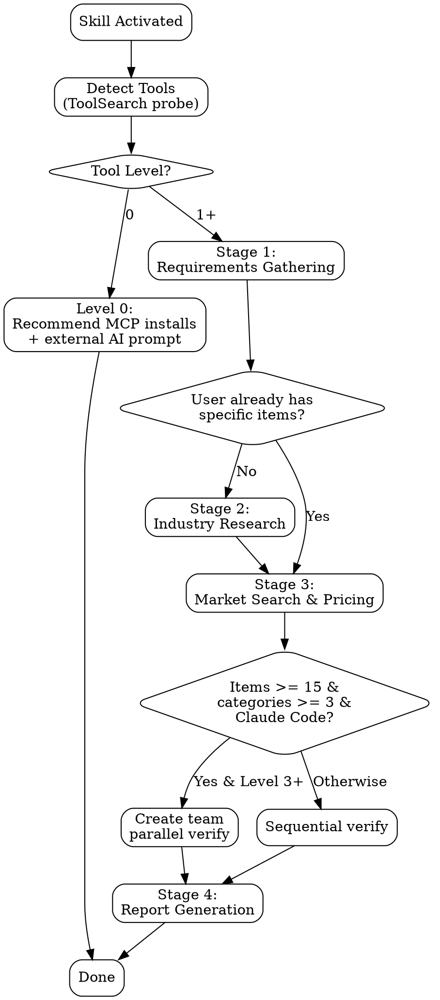

# Researching Consumer Goods

## Overview

Multi-stage consumer goods research skill. Gathers expert requirements, researches industry recommendations, searches local and global markets for prices and availability, and generates structured reports. Adapts to any product domain and geographic market.

## Main Workflow

```dot
digraph workflow {
  rankdir=TB;
  node [shape=box, style=rounded];

  activate [label="Skill Activated"];
  detect [label="Detect Tools\n(ToolSearch probe)"];
  level_check [shape=diamond, label="Tool Level?"];
  level0 [label="Level 0:\nRecommend MCP installs\n+ external AI prompt"];
  stage1 [label="Stage 1:\nRequirements Gathering"];
  has_items [shape=diamond, label="User already has\nspecific items?"];
  stage2 [label="Stage 2:\nIndustry Research"];
  stage3 [label="Stage 3:\nMarket Search & Pricing"];
  team_check [shape=diamond, label="Items >= 15 &\ncategories >= 3 &\nClaude Code?"];
  parallel [label="Create team\nparallel verify"];
  sequential [label="Sequential verify"];
  stage4 [label="Stage 4:\nReport Generation"];
  done [label="Done"];

  activate -> detect;
  detect -> level_check;
  level_check -> level0 [label="0"];
  level_check -> stage1 [label="1+"];
  level0 -> done;
  stage1 -> has_items;
  has_items -> stage3 [label="Yes"];
  has_items -> stage2 [label="No"];
  stage2 -> stage3;
  stage3 -> team_check;
  team_check -> parallel [label="Yes & Level 3+"];
  team_check -> sequential [label="Otherwise"];
  parallel -> stage4;
  sequential -> stage4;
  stage4 -> done;
}
```

---

## Stage 1: Expert Requirements Gathering

**Goal:** Understand what the user needs before any research begins.

Invoke the `prompt-74` skill's Rule 10 (iterative questioning — one question at a time, up to 10) to structure the requirements interview. Use the universal and domain-specific questions below as the question pool. Ask only what's missing — if the user's initial request already provides some answers, skip those.

**Universal questions (always ask if not provided):**

1. **Product domain** — Auto-detect from request or ask. Examples: ski gear, TVs, running shoes, furniture, cameras.
2. **Geography** — ALWAYS ASK: "Where are you located? This determines which stores, marketplaces, languages, and currencies I search." Never assume geography. Build geo context dynamically from the user's answer: country, language, currency, local marketplaces (e.g., Allegro for Poland, Amazon.de for Germany, Rakuten for Japan), shipping zones.
3. **Budget range** — In the user's local currency.
4. **Priority** — Quality / value / price-quality balance.
5. **Existing items** — Does the user already have specific items or brands in mind? If yes, skip Stage 2 and go directly to Stage 3 (verification only).
6. **Timeline** — Buying now vs. waiting for sales? End-of-season clearance timing matters.

**Domain-specific questions** — Read `references/expert-questions.md` for the relevant product domain. Ask the 3-5 most important domain-specific questions (sizes, specs, certifications, etc.).

**Output:** Save structured requirements brief to `{output-dir}/requirements.md` with all gathered parameters.

---

## Stage 2: Industry Research

**Goal:** Find expert-recommended items matching requirements.

Ask the user which path they prefer:

### Path A — Agent researches directly

- Search trusted review sites using available web tools (Jina search, WebSearch, Tavily)
- Domain-specific review sources are listed in `references/expert-questions.md` per domain
- Search in user's language AND English for broader coverage
- Cross-reference 3+ review sources per item
- Consider geo availability of brands (not all brands are sold in every market)
- Compile candidate item list (8-60 items depending on scope and categories)

### Path B — Generate external AI prompt

- Invoke the `prompt-74` skill for high-stakes prompt methodology (ownership framing, 10 rules, verification requirements) when structuring the research prompt
- Invoke the `prompt-creator` skill for model-specific formatting (Claude XML / OpenAI roles / generic markdown)
- Generate structured prompt from `references/external-ai-prompts.md` using the Path B template pattern from prompt-creator, structured with PROMPT-74 methodology
- Parameterize with: category, geo, budget, currency, priority, language, review sites, specific requirements
- User pastes into ChatGPT Deep Research / Gemini Deep Research / Claude Extended Thinking
- User returns with item list → proceed to Stage 3
- Always include closing instruction: "After receiving results, return here and I'll verify prices and availability"

**Output:** Save candidate list to `{output-dir}/research-items.md`.

---

## Stage 3: Market Search & Pricing

**Goal:** Find real prices, check availability, verify sizes/variants across markets.

### 3a-3b. Tool Detection & Fallback Chain

Invoke the `web-tool-routing` skill for tool detection (capability levels 0-4),
page reading fallback chain (7 tiers), web search fallback chain, and credit budget management.

Below are domain-specific overrides for consumer goods research.

#### Reading: E-Commerce Product Pages (Quality-Optimized Override)

> Differs from default chain: jumps past free tools to JS-capable tiers first. Default chain starts with WebFetch/Jina, but e-commerce sites (Amazon, Allegro, eBay) rely on JS rendering for prices, size selectors, and variant availability — free tools return empty or stale data.

| Priority | Tool | Why |
|----------|------|-----|
| 1 | **Firecrawl `firecrawl_scrape`** (waitFor=2000) | JS rendering captures dynamic pricing, size dropdowns, variant selectors |
| 2 | **ScrapingBee `get_page_text`** (render_js=true) | Anti-bot bypass for Cloudflare-protected stores (Amazon, some EU retailers) |
| 3 | **Tavily `tavily_extract`** | Good for simpler stores and price aggregator pages (Ceneo, Idealo) |
| 4 | **Jina `read_url`** | Clean extraction — works for static product pages and smaller retailers |
| 5 | **WebFetch** | AI-summarized — quick price check only, misses variants and availability |

#### Reading: Price Aggregator Pages

> Differs from default chain: free tools work well here — aggregators are simpler than individual stores. Default chain order is fine, but Jina/Tavily are preferred over WebFetch because aggregators list multiple prices in structured tables that AI-summarization loses.

| Priority | Tool | Why |
|----------|------|-----|
| 1 | **Jina `read_url`** | Clean markdown preserves price comparison tables |
| 2 | **Tavily `tavily_extract`** | Good structured extraction of multi-store price lists |
| 3 | **WebFetch** | AI summary — gets the cheapest price but loses the full comparison |
| 4 | **Firecrawl `firecrawl_scrape`** | Overkill for aggregators, save credits for product pages |

#### Search Priority (Consumer Goods Override)

> Differs from default chain: adds geo-targeted search and price-focused queries. Default chain optimizes for broad coverage; this override prioritizes local marketplace discovery and price comparison.

| Priority | Tool | Strength |
|----------|------|----------|
| 1 | **WebSearch** / **Jina `search_web`** (with geo params) | Free — find local retailers, aggregators, and deals |
| 2 | **Tavily `tavily_search`** (include_domains=[aggregators]) | Domain-filtered search for price aggregators (Ceneo, Idealo, Google Shopping) |
| 3 | **ScrapingBee `get_google_search_results`** | PAA reveals related products and comparison queries |
| 4 | **Firecrawl `firecrawl_search`** | Returns scraped content — useful when search snippets don't show prices |

### 3c. Team Decision (Claude Code only)

If ALL conditions met: items >= 15 AND categories >= 3 AND tool level >= 3:
- Offer to create a parallel agent team
- Read `references/team-orchestration.md` for team setup details
- Structure: Opus leader + N Sonnet workers (1 per category, max 6)
- Each worker gets: item list, geo context, tool fallback chain, credit budget, output path

Otherwise: sequential verification in the current session.

### 3d. Per-Item Verification Loop

For each item:
1. **Check local price aggregators first** — search Ceneo, Idealo, Google Shopping, PriceRunner (whichever serves the user's country) for the item. A single aggregator page reveals which stores carry it and at what price, saving many individual lookups. See `references/site-strategies.md` Pattern 5.
2. Search geo-relevant retailers for the item (use local marketplace + international stores) — include stores discovered via aggregators
3. Scrape product page using the fallback chain from the `web-tool-routing` skill — verify the best prices found on aggregators directly on the actual store (aggregator prices may be cached/stale)
4. Check size/variant/color availability — different colors/modifications on the same page can have different prices and different size availability. Report price per variant, not just the default. Try ALL variants before marking OOS.
5. Record per-item: price, stock status, URL, tool used, tier level, verification confidence
6. When encountering anti-bot blocks, apply pattern from `references/site-strategies.md`
7. Save interesting alternatives found during search to a backlog section

### 3e. Credit Budget Management

For paid tools (Firecrawl, ScrapingBee):
- **Formula:** `per_agent = total_credits / (num_agents + 1_reserve)`
- Track usage in output files (credits used / budget / remaining)
- Alert at 80% budget consumption
- When budget exceeded: switch to free tools only
- Built-in tools (WebSearch, WebFetch) are always available and truly unlimited. Free MCP tools (Jina, Tavily) have generous free tiers but are consumable (Jina: 10M tokens; Tavily: limited requests) — prefer all free tools before any paid tool, but be aware free MCP quotas can run out on large research sessions.

**Output:** Per-category `verify-{category}.md` files using template from `references/report-templates.md`.

---

## Stage 4: Report Generation

**Goal:** Compile all findings into actionable, structured reports.

Using templates from `references/report-templates.md`, generate:

1. **BEST-PICKS.md** — Top 2-3 verified picks per category with prices, stores, and verification status. Strike through items that became unavailable since initial research. Include verified promo codes.
2. **FINAL-REPORT.md** — Full summary with all items, prices, availability rates, retailer insights, and credit usage.
3. **verify-SUMMARY.md** — Cross-category statistics: total items, availability rates per category, credit usage breakdown by tool, key insights, price changes detected.

Additional reporting tasks:
- Track price changes from research → verification (deals expire fast)
- List verified promo codes with active/expired status
- Note retailer patterns (e.g., which stores are most reliable, which have best prices)

**Output:** All files saved to `{output-dir}/`.

---

## Troubleshooting

| Problem | Solution |
|---------|----------|
| Tool detection fails | Run manual ToolSearch: `+jina`, `+firecrawl`, `+scrapingbee`, `+tavily` |
| Anti-bot blocking on a site | Escalate tool tier per `references/site-strategies.md` |
| All tools fail for an item | Mark UNVERIFIED with manual-check URL |
| Credit budget exceeded | Switch to free tools only (WebSearch, WebFetch first; Jina, Tavily if free tier not exhausted) |
| No MCP tools available | Output install commands + generate external AI prompt |
| Sizes not visible (JS-rendered) | Firecrawl(waitFor=2000) or ScrapingBee(render_js=true) |
| Search returns irrelevant results | Add store domain filter, use product name + model number |
| Many items, slow progress | Suggest team orchestration (Claude Code) or reduce scope |
| Price changed since research | Flag in report, note original vs current price |
